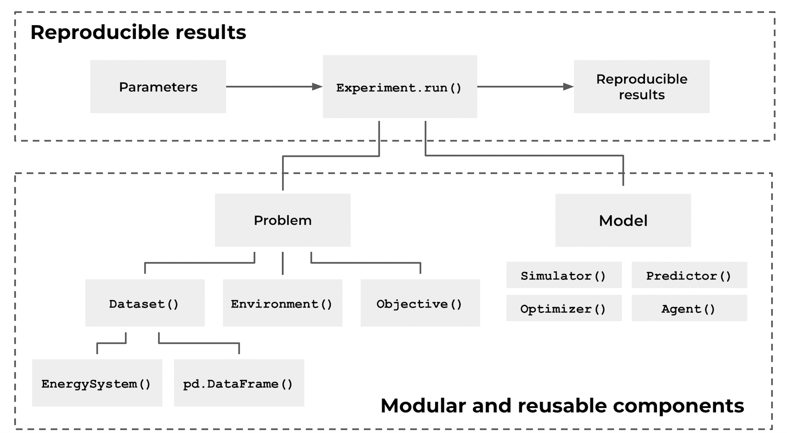

<div align="center">
	
<h2 style="margin-top: 0px;">
    ⚡ Open-source Python framework for modelling sequential decision problems in the energy sector
</h2>
</div>

<p align="center">
  <a href="https://opensource.org/licenses/MIT">
    
  </a>
  <a href="https://pypi.org/project/emflow/">
    
  </a>
  <a href="https://dub.sh/yTqMriJ">
    
  </a>
  <a href="#contributors">
    
  </a>
  <a href="https://github.com/rebase-energy/emflow">
    
  </a>
</p>

**emflow** is an open-source Python framework that enables energy data scientists and modellers to write modular and reproducible energy models that solves sequential decision problems. It is based on both OpenAI Gym (now [Gymnasium](https://dub.sh/Zk6l1b9)) and [Warran Powell's universal sequential decision framework](https://dub.sh/3RWwTXv). **emflow** lets you: 

* 🛤️ Structure your code as modular and reusable components and adopt the "model first, then solve"-mantra;
* 🌱 Forumate your problems with datasets, environments and objectives;
* 🏗️ Build agents, predictors, optimizers and simulators to solve sequential decision problems;
* 🧪 Run parametrized experiments that generate reproducible results (code, data and parameters); and
* ➿ Run sweeps for benchmarking, scenario analysis and parameter tuning.

**⬇️ [Installation](#installation)**
&ensp;|&ensp;
**📖 [Documentation](https://docs.energydatamodel.org/en/latest/)**
&ensp;|&ensp;
**🚀 [Try out now in Colab](https://colab.research.google.com/github/rebase-energy/emflow/blob/main/emflow/examples/heftcom2024/notebook.ipynb)**
&ensp;|&ensp;
**👋 [Join Slack Community](https://dub.sh/k0xlzzl)**

## The Sequential Decision Loop
**emflow** allows to model sequential decison problems, where state information **$S_t$** is provided, an action **$a_t=A^{\pi}(S_t)$** is taken, exogenous information **$W_{t+1}$** is revealed, whereby a new state **$S_{t+1} = S^M(S_t, a_t, W_{t+1})$** is encountered and a cost/contribution **$C(S_t,a_t,W_{t+1})$** can be calculated. The sequential decision loop then repeats until the end of the evaluation/problem time. 


The goal is to find an agent policy **$\pi$** that maximizes the contribution (or minimizes the cost) over the full time horizon **$t \in [0, T]$**. Mathematically formulated as: 

$$
\begin{equation*}
\begin{aligned}
\max_{\pi \in \Pi} \quad & \mathbb{E}^{\pi} \bigg[ \sum_{t=0}^T C(S_t,A^{\pi}(S_t),W_{t+1}) \bigg| S_0 \bigg] \\
\textrm{s.t.} \quad & S_{t+1} = S^M(S_t,a_t,W_{t+1})\\
\end{aligned}
\end{equation*}
$$

## Modules and Components
**emflow** consists of a set of components that serve as building blocks to create modular and reusable energy models. One of the main dependencies is [EnergyDataModel](https://github.com/rebase-energy/EnergyDataModel) that provides functionality to represent energy systems. The table below gives a summary of the available modules and concepts.

| Module         | Components     |
| :----          | :----            |
| 🔋&nbsp;`assets` | All energy asset and concept components defined by [EnergyDataModel](https://github.com/rebase-energy/EnergyDataModel) |
| 🗄️&nbsp;`data` | [`Field`](https://docs.emflow.org/en/latest/data/field.html), [`Dataset`](https://docs.emflow.org/en/latest/data/dataset.html), [`DataPortal`](https://docs.emflow.org/en/latest/data/portal.html) — point-in-time data access with availability semantics (leak-proof by construction) |
| 🧩&nbsp;`problems` | [`Problem`](https://docs.emflow.org/en/latest/problems/problem.html), [`IssueSchedule`](https://docs.emflow.org/en/latest/problems/schedule.html), [`Objective`](https://docs.emflow.org/en/latest/problems/objective.html), metrics ([pinball, MAE, RMSE, peak timing, trading revenue](https://docs.emflow.org/en/latest/problems/metrics.html)) |
| 🌍&nbsp;`envs` | [`ForecastEnv`](https://docs.emflow.org/en/latest/envs/forecast.html), [`TradingEnv`](https://docs.emflow.org/en/latest/envs/trading.html) — rolling-origin evaluation on the gymnasium API |
| 🧮&nbsp;`features` | [`Lag`, `Rolling`, `ForecastField`, `Calendar`](https://docs.emflow.org/en/latest/features/spec.html) — declarative, point-in-time-correct feature specs |
| 🤖&nbsp;`models` | [`Model`](https://docs.emflow.org/en/latest/models/model.html), [`Predictor`](https://docs.emflow.org/en/latest/models/predictor.html), [`Simulator`](https://docs.emflow.org/en/latest/models/simulator.html), [`Optimizer`](https://docs.emflow.org/en/latest/models/optimizer.html), [`Agent`](https://docs.emflow.org/en/latest/models/agent.html) |
| ♻️&nbsp;`run` | [`Experiment`](https://docs.emflow.org/en/latest/run/experiment.html), [`Result`](https://docs.emflow.org/en/latest/run/result.html), [`Verifier`](https://docs.emflow.org/en/latest/run/verifier.html), [analyzers](https://docs.emflow.org/en/latest/run/analyzers.html) |
| 🏆&nbsp;`benchmarks` | Historical competition problems: `heftcom2024` (forecasting + trading), `gefcom2012/2014/2017`, `bfcom2018`, `bigdeal2022` |

Below is a diagram of the components' relation to each other and how they together enable creation of reproducible results from energy models. 



## Framework 6-Step Approach
**emflow** is about adopting a problem-centric, stepwise approach that follows the "model first, then solve"-mantra. The idea is to first gain a deep problem understanding before rushing to the solution. Or as Albert Einstien expressed it: 

> **"If I had an hour to solve a problem I'd spend 55 minutes thinking about the problem and five minutes thinking about solutions."**

Concretely, this means that problems are solved through the following steps: 

1. Define the considered **energy system**;
2. Define **state**, **action** and **exogenous** variables;
3. Create the **environment** and the transition function;
4. Define the **objective** (cost or contribution);
5. Create the **model** (simulator, predictor, optimizer and/or agent) to operate in environment; and
6. Run the **sequential decision loop** and evaluate performance.

Steps 1-4 are about understanding the **problem** and steps 5-6 are about creating and evaluating the **solution**. 

## Basic Usage
A benchmark problem bundles a dataset, an environment factory, a schedule, an
objective and temporal splits. Load one, run a model through an `Experiment`,
and inspect the `Result`:

```python
import emflow as ef
from emflow.benchmarks.heftcom2024.baseline import BinnedQuantileBaseline

problem = ef.load_problem("heftcom2024:forecasting")   # a real competition
result = ef.Experiment(problem, BinnedQuantileBaseline()).run()

print(result.score)                          # pinball loss on the validation split
print(result.analysis["PersistenceSkill"])   # skill vs the persistence baseline
print(result.rank_against(problem))          # place on the official 2024 leaderboard
```

Every observation a model sees is served through the point-in-time
[`DataPortal`](https://docs.emflow.org/en/latest/data/portal.html), so
look-ahead leakage is impossible by construction — which is what makes the
scores trustworthy for agent benchmarking. Untrusted submissions are scored
with the [`Verifier`](https://docs.emflow.org/en/latest/run/verifier.html)
on a held-out split whose labels live in a private repo (see
`submissions/README.md`).

## Installation
We recommend installing using a virtual environment like [venv](https://docs.python.org/3/library/venv.html), [poetry](https://python-poetry.org/) or [uv](https://docs.astral.sh/uv/). 

Install the **stable** release: 
```bash
pip install emflow
```

Install the **latest** release: 
```bash
pip install git+https://github.com/rebase-energy/emflow.git
```

Install in editable mode for **development**: 
```bash
git clone https://github.com/rebase-energy/EnergyDataModel.git
git clone https://github.com/rebase-energy/emflow.git
cd emflow
pip install -e .[dev]
pip install -e ../EnergyDataModel[dev]
```

## Ways to Contribute
We welcome contributions from anyone interested in this project! Here are some ways to contribute to **emflow**:

* Create a new environment; 
* Create a new energy model (simulator, predictor, optimizer or agent); 
* Create a new objective function; or
* Create an integration with another energy modelling framework.

If you are interested in contributing, then feel free to join our [Slack Community](https://dub.sh/k0xlzzl) so that we can discuss it. 

## Contributors
This project uses [allcontributors.org](https://allcontributors.org/) to recognize all contributors, including those that don't push code. 

<!-- ALL-CONTRIBUTORS-LIST:START - Do not remove or modify this section -->
<!-- prettier-ignore-start -->
<!-- markdownlint-disable -->
<table>
  <tbody>
    <tr>
      <td align="center" valign="top" width="14.28%"><a href="https://github.com/sebaheg"><br /><sub><b>Sebastian Haglund</b></sub></a><br /><a href="#code-sebaheg" title="Code">💻</a></td>
      <td align="center" valign="top" width="14.28%"><a href="https://github.com/dimili"><br /><sub><b>dimili</b></sub></a><br /><a href="#code-dimili" title="Code">💻</a></td>
      <td align="center" valign="top" width="14.28%"><a href="https://github.com/rocipher"><br /><sub><b>Mihai Chiru</b></sub></a><br /><a href="#code-rocipher" title="Code">💻</a></td>
      <td align="center" valign="top" width="14.28%"><a href="https://github.com/nelson-sommerfeldt"><br /><sub><b>Nelson</b></sub></a><br /><a href="#ideas-nelson-sommerfeldt" title="Ideas, Planning, & Feedback">🤔</a></td>
    </tr>
  </tbody>
</table>

<!-- markdownlint-restore -->
<!-- prettier-ignore-end -->

<!-- ALL-CONTRIBUTORS-LIST:END -->

## Licence
This project uses the [MIT Licence](LICENCE.md).  

## Acknowledgement
The authors of this project would like to thank the Swedish Energy Agency for their financial support under the E2B2 program (project number P2022-00903)

